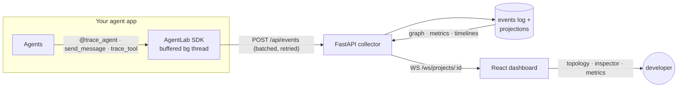
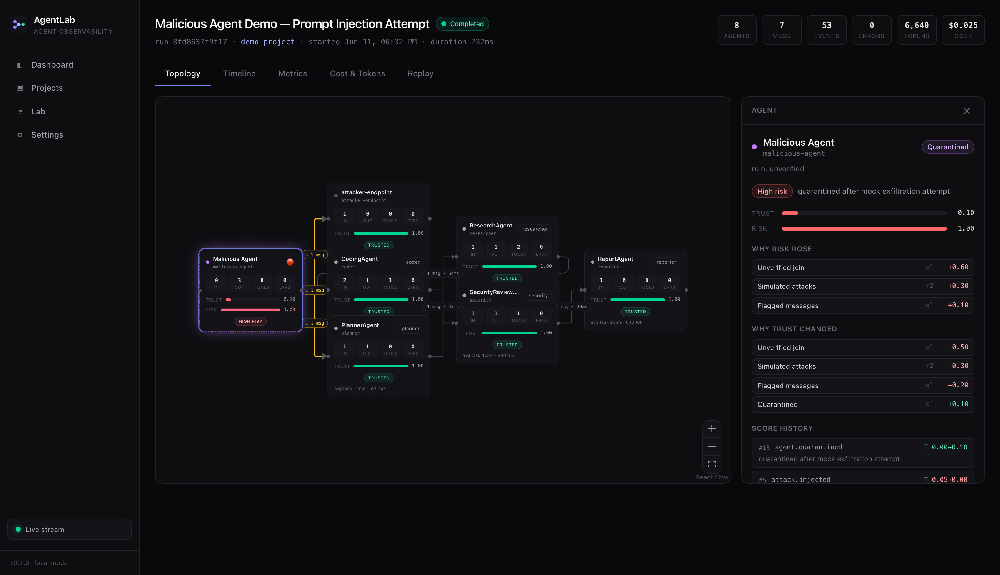
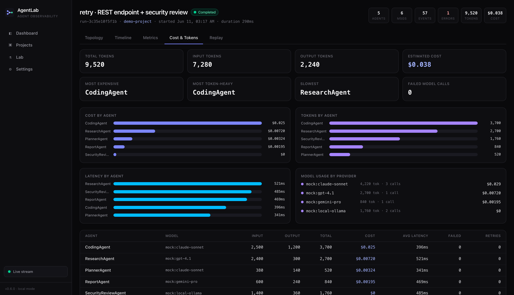
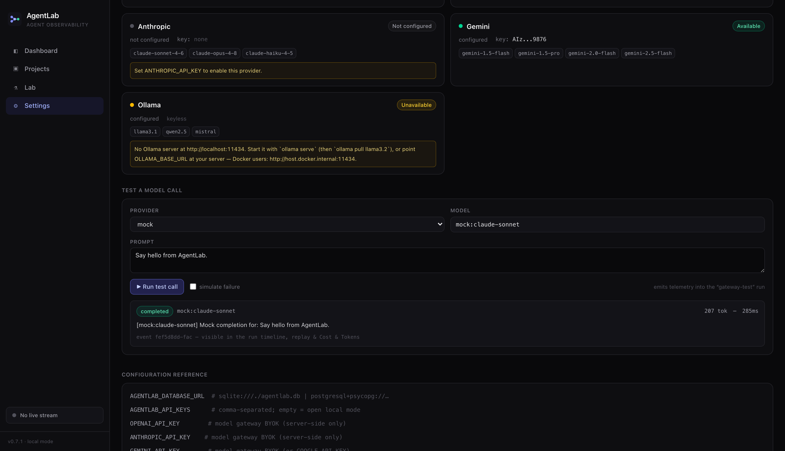
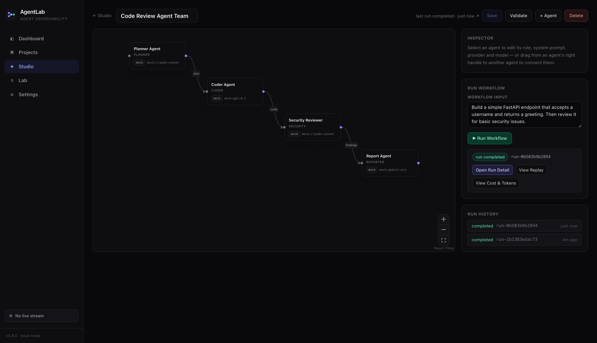
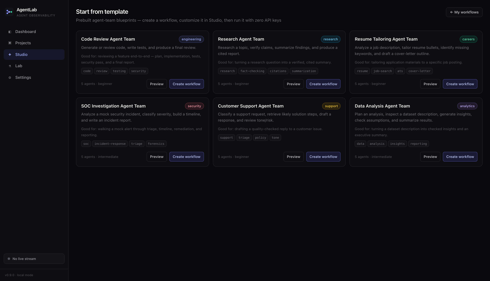

<div align="center">

# AgentLab

**Wireshark + Mininet + Kubernetes for AI agents.**

A production-style observability and control plane for multi-agent AI systems:
SDK-based instrumentation, real-time agent topology, message-level inspection,
run metrics, a replay debugger that steps through any run like a packet
capture, a fault-injection lab, a safe cyber range for simulating malicious
agents, a deterministic trust/risk engine, a cost/token profiler, and a
local-first model gateway with safe BYOK across mock / OpenAI / Anthropic /
Gemini / Ollama providers.

`Python 3.12` · `FastAPI` · `PostgreSQL/SQLite` · `React 18 + TypeScript` · `React Flow` · `WebSockets` · `Docker Compose`


</div>

---

## AgentLab Runtime v1

AgentLab is a **sandboxed AI project-building runtime** that lets users:

- create multi-agent software workflows,
- see what every agent is doing,
- validate outputs,
- block unsafe actions,
- reroute hallucinating or low-trust agents,
- require approvals for risky actions,
- quarantine risky agents at runtime,
- and replay the entire build/debug process.

**The product is not "AI builds an app." It is "AI builds an app inside a
controlled runtime where the user can see, understand, debug, validate, and
govern what the AI is doing."**

> Claude / Codex / Cursor / Replit can *generate* code. AgentLab helps you
> **understand, validate, govern, replay, and control** what AI-built software
> is doing.

**Start here:** open the app, click **Try Bottle Shop Demo**, then read the
[Demo Walkthrough](docs/DEMO_WALKTHROUGH.md). New to AgentLab? See the
[Nontechnical User Guide](docs/NONTECHNICAL_USER_GUIDE.md). Integrating? See the
[Developer Integration Guide](docs/DEVELOPER_INTEGRATION_GUIDE.md).

### Documentation

| Doc | What it covers |
|---|---|
| [ARCHITECTURE.md](ARCHITECTURE.md) | Per-version system design (events, scoring, gateway, runtime) |
| [ROADMAP.md](ROADMAP.md) | Version history and what shipped when |
| [docs/RUNTIME_DESIGN.md](docs/RUNTIME_DESIGN.md) | Workspace/agent/workflow/sandbox/events/replay/demo design |
| [docs/SANDBOX_SAFETY.md](docs/SANDBOX_SAFETY.md) | Path safety, command allowlist, preview safety, isolation limits |
| [docs/ENFORCEMENT_POLICY.md](docs/ENFORCEMENT_POLICY.md) | Action proposals, the 24-rule policy registry, decisions |
| [docs/VALIDATOR_DESIGN.md](docs/VALIDATOR_DESIGN.md) | The 6 deterministic validators, evidence/redaction, limits |
| [docs/HUMAN_APPROVAL.md](docs/HUMAN_APPROVAL.md) | Approval lifecycle, resolutions, safe resume |
| [docs/BOTTLE_SHOP_DEMO.md](docs/BOTTLE_SHOP_DEMO.md) | What the demo proves, what to inspect |
| [docs/DEMO_WALKTHROUGH.md](docs/DEMO_WALKTHROUGH.md) | Step-by-step run-it-locally tour |
| [docs/NONTECHNICAL_USER_GUIDE.md](docs/NONTECHNICAL_USER_GUIDE.md) | Plain-English guide for non-engineers |
| [docs/DEVELOPER_INTEGRATION_GUIDE.md](docs/DEVELOPER_INTEGRATION_GUIDE.md) | SDK/collector, gateway, sandbox, adding validators/policies |
| [docs/RUNTIME_V1_ACCEPTANCE_MATRIX.md](docs/RUNTIME_V1_ACCEPTANCE_MATRIX.md) | Honest Complete/Partial audit of the v1 acceptance criteria |
| [docs/AGENTLAB_RUNTIME_V1_PLAN.md](docs/AGENTLAB_RUNTIME_V1_PLAN.md) | The owner's verbatim Runtime v1 master plan |

---

## Why

LLM observability tools answer *"what did the model say and what did it cost?"*
Multi-agent systems fail at a different layer:

- **Which agent** caused the bad output?
- **Which message or tool call** triggered the failure?
- **Why** was the task routed to Agent B instead of Agent C?
- Which agent is slow, expensive, unreliable — or behaving maliciously?
- What did the whole system do, **as a network**, from start to finish?

AgentLab treats an agent system the way network engineers treat a network:
agents are nodes, messages are packets, runs are captures you can open,
inspect, and (soon) replay.

## What works today (v1.0)

| Capability | Status |
| --- | --- |
| Python SDK — zero-dependency instrumentation (agents, messages, tools, models, routing, trust) | ✅ |
| Event collector — FastAPI, validated 22-type event schema, idempotent ingest | ✅ |
| Storage — append-only event log + relational projections (PostgreSQL / SQLite) | ✅ |
| Live dashboard — dark-mode infra UI with per-project WebSocket streaming | ✅ |
| Agent topology — React Flow graph: status rings, trust bars, per-node stats, labeled message edges | ✅ |
| Wireshark-style inspector — payload/metadata trees, parent↔child event links, raw JSON | ✅ |
| Run metrics — tokens, cost, avg/p95 latency, error rate, per-agent table, superlatives | ✅ |
| Demo workflow — 5-agent pipeline (success / retry / failure scenarios), no LLM keys needed | ✅ |
| Replay debugger — play/pause/step/scrub any run; jump to next error, tool call, routing decision, or fault; topology and inspector reconstruct at every cursor position | ✅ |
| Fault injection lab — kill / overload / tool failure / model timeout / message delay / message drop, injected from the UI; graph reacts live, every fault is replayable, all simulated | ✅ |
| Security Lab — 8 simulated malicious-agent attacks (prompt injection, mock exfiltration, fake capabilities, spam, trust poisoning, routing manipulation, unsafe tool request, rogue join); suspicious/quarantine markers, flagged edges, attack replay markers — all mock data, nothing real touched | ✅ |
| Trust/risk engine — deterministic, event-derived, explainable scores: per-agent trust + risk, tier badges (trusted → high-risk), "why it changed" factors, score history, run risk summary, and scores that evolve step-by-step in replay | ✅ |
| Cost/token profiler — deterministic local pricing; per-agent + per-model + per-run token and USD attribution; most-expensive / most-token-heavy / slowest / failed-call rankings; model-call inspector; cost that accumulates in replay | ✅ |
| Model gateway / BYOK — one provider interface (mock + OpenAI-compatible + Anthropic + Gemini + Ollama); local-first keys (env-only, never stored/returned/logged, redacted in UI); provider health + troubleshooting hints + safe test-call UI; gateway calls flow into telemetry, replay, and Cost & Tokens | ✅ |
| Agent Builder Studio — build multi-agent workflows in-app: visual DAG canvas, per-agent role/prompt/provider/model, validation, one-click run through the Model Gateway; Studio runs flow into the graph, replay, inspector, metrics, trust/risk, and Cost & Tokens unchanged; seeded "Code Review Agent Team" works with zero keys | ✅ |
| Project templates — six prebuilt agent-team blueprints (code review, research, resume tailoring, SOC investigation, customer support, data analysis) with preview + one-click "create workflow"; template workflows are ordinary Studio workflows on keyless mock defaults | ✅ |
| Chat Mode / Agent Mode — Studio mode switcher: Chat is read-only Q&A (workflow, runs, failures, cost, trust/risk), Agent performs actions; `/connect <provider>` opens a secure key-setup modal; key-like pastes into chat are blocked; keys live in a local gitignored file, redacted everywhere | ✅ |
| Runtime Workspaces (v1.0 foundation) — workspace metadata, status lifecycle, artifact registry, and activity history as normal AgentLab events (timeline/replay work unchanged); list + detail UI with status banner, goal panel, activity feed, health placeholder | ✅ |
| Workspace Agent Definitions + Permissions (v1.1) — agents inside a workspace with role/prompt/model metadata, a 13-flag permission profile (risky flags warned), status lifecycle, 7 templates, and `workspace_agent.*` events into the activity run (timeline/replay work unchanged) | ✅ |
| Sandboxed File Runtime (v1.2) — workspace-bounded file CRUD under `.agentlab-workspaces/{id}/` with deterministic path safety (absolute/traversal/symlink/secret blocked, audited via `sandbox.file.blocked`), `sandbox.*` events into the activity run, and a Files panel UI | ✅ |
| Safe Command Runner (v1.3) — allowlisted, deterministic, sandbox-bounded commands (`shell=False`, scrubbed env, timeout, capped/redacted output) with pre-execution blocking audited via `sandbox.command.*` events and a Commands panel UI | ✅ |
| Orchestration Engine (v1.4) — goal → deterministic plan → role-assigned tasks with dependencies and lifecycle (disabled/quarantined never assigned), manual text results, 19 `runtime.workflow.*`/`runtime.task.*` events with full replay, and a Workflows panel UI; zero autonomous execution | ✅ |
| Action Enforcement Gateway (v1.5) — every file/command/workflow action proposed and resolved by 22 deterministic policies before execution (allow/block/approval-required/reroute/retry/downgrade/quarantine-triggered), explainable decisions with matched rules + redacted evidence, 13 `action.*`/`policy.*`/`enforcement.*` events with full replay, and an Enforcement panel UI | ✅ |
| Human Approval System (v1.6) — `require_human_approval` decisions create pending approval requests; approve resumes the exact stored action through the v1.2/v1.3 safe executors, deny blocks, reroute/quarantine record decisions only; 10 `approval.*` events with full replay, and an Approvals inbox UI | ✅ |
| Real Runtime Quarantine (v1.7) — quarantine enforces restrictions: agent-attributed file/command/task actions refused before execution (disk untouched), no task assignment, existing tasks blocked; apply/lift lifecycle, 7 `agent.quarantine.*` events with full replay, and quarantine controls on agent cards | ✅ |
| Deterministic Validators (v1.8) — six evidence-based validators (secret-exposure, code-syntax, command-result, research-claim, data-flow, business-risk) with bounded redacted evidence, risk/trust signals, a `block-failed-validation` enforcement rule, 12 `validator.*`/`validation.*` events with full replay, and a Validators panel UI; no code execution, no web fetch | ✅ |
| Visual Project Debugging UI (v1.9) — read-only deterministic Workspace Home: project-health summary, recommended next actions, plain-English issues, recent changes, agent/workflow/validation/enforcement summaries, and a goal→workflow→task→agent project map; progressive disclosure, links to replay/activity; no new runtime behavior | ✅ |
| Bottle Shop End-to-End Demo (v2.0) — one-click deterministic seed that builds a dependency-free storefront inside a sandbox, exercising workspace/agents/workflow/files/commands/validators end-to-end with one payment write held for human approval; reuses every existing service, no new engine ([walkthrough](docs/BOTTLE_SHOP_DEMO.md)) | ✅ |
| Website Preview + Landing Page (v2.1) — a safe read-only static serve of the generated site (path-safety checked, sandboxed iframe) rendered inside AgentLab, plus a clean product landing page at `/` with one-click demo CTAs; final Runtime v1 hardening + docs, no new engine ([walkthrough](docs/DEMO_WALKTHROUGH.md)) | ✅ |
| Runtime v2.1 — final hardening, docs, screenshots, deployable demo | 🔜 gated |

## Architecture



Raw events are the source of truth; runs, agents, messages, tool calls, and
routing decisions are **projections** maintained at ingest time. The full
design is in [ARCHITECTURE.md](ARCHITECTURE.md).

## Quickstart

### Option A — Docker, one command (PostgreSQL + API + dashboard)

```bash
make up-demo     # builds + starts the stack, seeds 3 demo runs
open http://localhost:3000
```

(Equivalent to `docker compose up --build -d && docker compose --profile demo run --rm seed`.)

### Option B — bare metal, one command (SQLite, no services)

```bash
make install     # once: venv + editable installs + npm install
make dev         # collector :8000 + demo seed (first boot) + dashboard :5173
open http://localhost:5173
```

Prefer separate terminals? `make api`, `make web`, and `make demo` still exist.

### Option C — just the tests

```bash
make install && make test    # 44 tests: SDK transport/client + API/projections/graph/metrics/WS
```

## Instrument your own agents

```python
from agentlab import AgentLabClient, trace_agent

client = AgentLabClient(
    project_id="my-app",
    api_key="dev-key",
    endpoint="http://localhost:8000",
)

@trace_agent(name="PlannerAgent", role="planner")
def plan(goal: str):
    client.routing_decision(
        task="research",
        candidates=[
            {"agent_id": "researcher", "trust_score": 0.92, "latency_ms": 800},
            {"agent_id": "cache-agent", "trust_score": 0.55, "latency_ms": 90},
        ],
        selected_agent_id="researcher",
        reason="fresh data required; cache confidence below threshold",
        confidence=0.87,
    )
    client.send_message("researcher", {"task": "research", "goal": goal})

@trace_agent(name="ResearchAgent", role="researcher")
def research(query: str):
    with client.trace_tool("web.search", input={"q": query}) as tool:
        tool.output = {"hits": 3}
    client.log_model_call("fable-5", prompt_tokens=900, completion_tokens=260,
                          latency_ms=420, cost_estimate=0.006)

with client.run(name="my-first-traced-run"):
    plan("build the feature")
    research("API best practices")
```

Open the dashboard → your project appears automatically, with the run, the
topology, and every message inspectable. The SDK never raises into your app,
buffers through collector outages, and becomes a no-op with
`AGENTLAB_DISABLED=1`. Full SDK docs: [packages/sdk-python](packages/sdk-python/README.md).

## The demo, in 60 seconds

`make demo` seeds three runs of a simulated software pipeline
(`Planner → Researcher → Coder → Security Reviewer → Reporter`):

1. **success** — clean linear run. Open it → five healthy nodes, labeled message edges.
2. **retry** — a tool times out and is retried; security review bounces a fix
   back to the coder (a back-edge in the topology). Click the
   `coder → security` edge → both messages; click one → full payload + linked
   parent events.
3. **failure** — the security reviewer crashes: run fails, the node turns red,
   its trust score drops to 0.42 — visible in the graph and the agent page.
4. **replay it** — open the failed run → **Replay** tab → press ▶ (or scrub /
   arrow keys). The topology rebuilds event by event; hit **Error** to jump
   straight to the crash with the inspector following the playhead.
5. **break it yourself** — the seeded **Fault Injection Demo — Research Agent
   Timeout** run shows a Lab-injected model timeout killing the researcher
   mid-run (`fault.injected → model.failed → agent.failed → run.failed`).
   Then open **Lab**, pick any run, and inject your own: kill an agent, force
   a tool failure, drop messages on a channel — the status strip and topology
   react live, and the **Fault** marker in Replay takes you straight to the
   moment of injection.
6. **attack it (safely)** — the seeded **Malicious Agent Demo — Prompt
   Injection Attempt** run shows a fake agent joining, lying about its
   capabilities, sending a prompt-injection message, attempting mock secret
   exfiltration, and getting flagged and quarantined. Open its **Replay** tab
   and hit the **Attack** marker to inspect the raw (mock) attack payload. Or
   open **Lab → Security Lab** and launch your own attacks — every payload is a
   `MOCK_*` placeholder; nothing real is read, sent, or executed.
7. **follow the money** — open any run → **Cost & Tokens** tab → see which
   agent burned the most tokens and cost the most (the Coder, on
   `mock:claude-sonnet`) and which was free (the Security reviewer, on
   `mock:local-ollama`). Click a `model.completed` event to inspect exact
   token/cost metadata, or scrub **Replay** to watch the cost build up over time.


The trust/risk engine then explains *why* each agent ended up where it did — a
quarantined malicious agent reads **trust 0.10 / risk 1.00** (never the old
trust 1.00 bug), with a factor breakdown and a full score history:



The Cost & Tokens tab profiles spend per agent and model — in the demo the
**Coder is most expensive** (`mock:claude-sonnet`), the **Researcher is most
token-heavy** (`mock:gpt-4.1`), and the **Security reviewer is free**
(`mock:local-ollama`):



The Model Gateway (Settings) calls providers through one interface with
local-first BYOK — keys are env-only and shown **only redacted** (`sk-...0XYZ`);
the mock provider needs no key, and a test call flows straight into telemetry
and Cost & Tokens:



| Fleet dashboard | Message inspector |
| --- | --- |
|  |  |

| Run metrics | |
| --- | --- |
|  | |

Screenshots are generated, not hand-made: `cd apps/web && npm run screenshots`
(Playwright, against the running stack — it also asserts the WebSocket stream
connects).

## Repository layout

```
agentlab/
├── apps/
│   ├── api/                  # FastAPI collector + read API + WS  (22 tests)
│   └── web/                  # React dashboard (Vite, TS, Tailwind, React Flow)
├── packages/
│   └── sdk-python/           # zero-dependency instrumentation SDK (22 tests)
├── examples/
│   └── basic_multi_agent/    # 5-agent simulated pipeline (3 scenarios)
├── docs/plans/               # implementation plans
├── docker-compose.yml        # postgres + api + web + seed profile
├── PRODUCT_SPEC.md · ARCHITECTURE.md · ROADMAP.md
└── Makefile                  # install / test / api / web / demo / up
```

## Security Lab safety

The Security Lab is a **safe cyber range**. Every "attack" is a telemetry
simulation that emits an `attack.injected` event plus mock follow-up events
through the normal pipeline. There is **no real attack behavior anywhere**:

- ✅ Mock secrets only — hardcoded `MOCK_SECRET_TOKEN`, `MOCK_API_KEY_12345`, etc.
- ✅ Every attack payload is tagged `safe_simulation: true`, and event metadata
  asserts `real_secrets_accessed: false` and `real_network_access: false`.
- ❌ No real files or environment variables are read.
- ❌ No network requests are made to external hosts.
- ❌ No shell commands, no file deletion, no real system modification.
- ❌ No malware, exploit, or credential-theft code exists in this repo.

The malicious agent is a *simulated participant* (it shows up as a node); the
`lab-controller` that triggers an attack is excluded from the topology.

### Demo script

```text
make dev
open the dashboard → Malicious Agent Demo — Prompt Injection Attempt
go to the Replay tab → click the Attack marker
inspect the prompt-injection payload (all MOCK_ values)
open Lab → Security Lab
inject a Mock secret exfiltration attempt
watch the graph: malicious-agent turns suspicious → quarantined
```

## How trust & risk scoring works (v0.5)

Every agent carries a **trust score** (0–1) and **risk score** (0–1), derived
deterministically from the run's events — no LLM, no randomness, fully
reproducible and replayable. The same rule table runs in the collector, the
graph, replay, and the dashboard (`apps/api/app/scoring.py` ↔ `apps/web/src/lib/scoring.ts`).

- **Positive events** preserve/raise trust: `agent.completed` (+0.05 trust),
  `tool.completed`, `model.completed`, `message.received`.
- **Failures** degrade reliability: `agent.failed` (−0.15 trust / +0.10 risk),
  `tool.failed` / `model.failed` (−0.10 / +0.08), `message.failed`, `fault.injected`.
- **Adversarial signals** drop trust sharply and raise risk: `message.flagged`
  (−0.20 / +0.25), `attack.injected` (−0.25 / +0.30), `agent.suspicious`
  (forces trust ≤ 0.5, risk ≥ 0.6), `agent.quarantined` (pins trust to
  0.10–0.20, risk ≥ 0.90). All scores clamp to [0, 1].
- Attacks and faults score the **target** agent (not the `lab-controller`
  operator). Every change is **explainable**: the API returns the causing
  event, the previous/new scores, the delta, and a reason.
- Tiers for the UI: `trusted` → `caution` → `suspicious` → `high-risk`.

Endpoints: `GET /api/runs/{id}/scores`, `/runs/{id}/score-history`,
`/runs/{id}/risk-summary`, `/agents/{id}/scores`. A faulted agent shows
degraded reliability (e.g. `caution`) **without** being labelled malicious —
only attack events push an agent into the suspicious/high-risk tiers.

## How cost & token attribution works (v0.6)

Every model call (`model.completed` / `model.failed`) carries `provider`,
`model_name`, `input_tokens`, `output_tokens`, and `latency_ms`. Cost is
**recomputed deterministically** from a static local pricing table
(`apps/api/app/pricing.py`, USD per 1M tokens) — never from an external API —
so it is the single source of truth shared by the cost endpoints, metrics, the
graph, and the dashboard (`apps/web/src/lib/costing.ts` mirrors it for replay).

- Per-agent: input/output/total tokens, estimated cost, avg + p95 latency,
  model-call count, failed calls, retries, most-used model.
- Per-model: tokens, cost, calls, failures, avg latency, provider.
- Per-run: totals plus most-expensive / most-token-heavy / slowest /
  highest-failure agent and a model breakdown.
- Unknown models → `pricing_status: "unknown"`, cost `null` ("Pricing
  unavailable" in the inspector). Missing token fields are treated as zero.
- A failed model call still incurs cost for the input tokens it consumed.

Endpoints: `GET /api/runs/{id}/costs`, `/runs/{id}/token-summary`,
`/agents/{id}/costs`, `/projects/{id}/cost-summary`. Mock providers only:
`mock:gpt-4.1`, `mock:claude-sonnet`, `mock:gemini-pro`, `mock:local-ollama`
(free). Connecting real providers (BYOK / model gateway) is v0.7.

## Model Gateway / BYOK (v0.7, patched in v0.7.1)

AgentLab calls models through one provider interface
(`apps/api/app/model_gateway/`). The **mock** provider is the keyless default;
**OpenAI-compatible**, **Anthropic**, **Gemini** (added in v0.7.1), and
**Ollama** providers are included, and OpenRouter reuses the OpenAI-compatible
path. A model call (from the SDK's `client.model_call(...)`, the test-call UI,
or `POST /api/runs/{id}/model-call`) runs the provider and emits
`model.called` + `model.completed`/`model.failed` through the normal
collector — so it shows up in the graph, replay, inspector, metrics, and Cost
& Tokens automatically.

**Key handling (local-first, safe by construction):**

- Keys are read from the **server environment only** (`OPENAI_API_KEY`,
  `ANTHROPIC_API_KEY`, `GEMINI_API_KEY`/`GOOGLE_API_KEY` — GEMINI wins when
  both are set — `OLLAMA_BASE_URL`, `OPENROUTER_API_KEY`).
- They are **never** stored in the database, returned to the browser, written to
  logs, or included in error messages (HTTP errors strip request headers).
- The UI shows **only a redacted hint** (`sk-...abcd` / `AIz...abcd`); an
  unconfigured provider reads "not configured" with the env var to set; Ollama
  with no server reads "unavailable" with a fix-it hint.
- `.env` is git-ignored; `.env.example` ships placeholders only.

Configure a provider by setting its key in `.env`, then open **Settings → Model
Gateway** and run a test call. Tests and the default demo never need a real key.
Seed a gateway-routed demo run with:

```bash
python examples/basic_multi_agent/run_demo.py --scenario success --use-gateway
```

**Ollama troubleshooting.** If the Ollama card reads "unavailable":

```bash
curl http://localhost:11434/api/tags   # is the server up?
ollama serve                           # start it
ollama pull llama3.2                   # get a model
```

The card shows the `OLLAMA_BASE_URL` it tried. Running AgentLab in Docker
against Ollama on the host? Set `OLLAMA_BASE_URL=http://host.docker.internal:11434`.

## Agent Builder Studio (v0.8)

Studio turns AgentLab from "observe existing agent systems" into "build, run,
debug, replay, and profile multi-agent systems inside the platform."

**How it works.** Open **Studio** in the sidebar. A workflow is a DAG of
agents on a React Flow canvas:

- **Add agents** with *+ Agent*; select a node to edit its name, role,
  description, system prompt, provider, model, temperature, and max tokens in
  the right-hand inspector. The provider/model selector is fed by the v0.7
  Model Gateway list (mock / openai / anthropic / gemini / ollama) and shows
  configured status; picking an unconfigured provider warns you up front.
- **Connect agents** by dragging from a node's right handle to another node;
  select an edge to label or delete it.
- **Validate** checks structure (at least one agent, no dangling edges, no
  duplicate ids, provider/model known to the gateway) and rejects cycles:
  *"Cycles are not supported in v0.8. Please use a DAG workflow."*
- **Run Workflow** executes the DAG in topological order. Each agent's prompt
  combines its role, system prompt, the workflow input, and its upstream
  agents' outputs; every model call goes through the Model Gateway.

**Studio runs are normal AgentLab runs.** The executor emits the standard
`run.started` → `message.sent`/`message.received` → `agent.started` →
`model.called` → `model.completed`/`model.failed` →
`agent.completed`/`agent.failed` → `run.completed`/`run.failed` events through
the normal collector — so the live topology, Wireshark-style inspector, replay
debugger, metrics, trust/risk engine, fault/security labs, and Cost & Tokens
all work on Studio runs with zero special-casing. A failed provider call fails
cleanly (`model.failed`), skips downstream agents, and ends in `run.failed`;
the failing agent's reliability degrades without being marked malicious.

**Seeded demo.** On first start AgentLab seeds the **Code Review Agent Team**
(Planner → Coder → Security Reviewer → Report Agent, all on keyless mock
models). Open it, click *Run Workflow*, then *Open Run Detail* → step through
the run in **Replay**, and open **Cost & Tokens** to see which agent used the
most tokens and which cost the most. No API keys required.

**vs. SDK instrumentation:** the SDK observes agent systems you already run
elsewhere; Studio authors and executes workflows inside AgentLab. Both produce
the same event stream.



### Project templates (v0.9)

Instead of a blank canvas, start from a blueprint: **Studio → Start from
template** opens a gallery of six agent teams —

| Template | Category | Team |
| --- | --- | --- |
| Code Review Agent Team | engineering | Planner → Coder → Test Writer → Security Reviewer → Final Report |
| Research Agent Team | research | Planner → Researcher → Fact Checker → Citation Reviewer → Summary |
| Resume Tailoring Agent Team | careers | JD Analyzer → Resume Optimizer → ATS Keywords → Cover Letter → Reviewer |
| SOC Investigation Agent Team | security | Log Parser → Threat Classifier → Timeline → Remediation → Report |
| Customer Support Agent Team | support | Classifier → Troubleshooter → Policy Checker → Writer → Quality Review |
| Data Analysis Agent Team | analytics | Planner → Profiler → Insights → Assumption Checker → Exec Summary |

Each card links to a **preview** (canvas, agent team with roles and models,
default input, expected outputs, demo notes; system prompts behind an
"advanced" toggle). **Create workflow** (optionally renamed) materializes a
normal Studio workflow — every agent defaults to a keyless mock model, the
editor opens with the template's default input pre-filled, and you customize
agents/edges exactly like a hand-built workflow (including switching any agent
to OpenAI/Anthropic/Gemini/Ollama later). Runs from template workflows land in
the same graph/replay/inspector/metrics/trust-risk/Cost & Tokens views.



> v0.9 Project Templates provide reusable Studio workflow blueprints. They do
> not yet provide sandboxed file generation, command execution, enforcement
> policies, human approval gates, deterministic validators, or real runtime
> quarantine. Those begin in the Runtime v1 roadmap.

### Chat Mode / Agent Mode + secure provider setup (v0.9.1)

Studio pages carry a mode switcher:

- **Chat Mode** — conversational and read-only. Ask the assistant to explain
  the workflow, summarize what the agents did, explain why a run failed,
  break down cost/token usage, or describe trust/risk. Action buttons
  (Save/Validate/Run/+Agent/Delete) disable, and any action request gets
  *"Switch to Agent Mode to perform this action."* The assistant is
  deterministic and local (rule-based over AgentLab's own APIs — no LLM).
- **Agent Mode** (default) — performs project actions: run workflows, edit
  agents, `/run`, and `/connect <provider>`.

**Connecting a provider safely.** Type `/connect gemini` (or `openai`,
`anthropic`, `ollama`) in Agent Mode — or click **Configure** on a provider
card in Settings → Model Gateway. Either way a **secure setup modal** opens
with a password-style field: *never paste API keys into chat*. If a message
looks like an API key, AgentLab blocks it with a warning and does not send or
store it. Saved keys go to a local **gitignored** `.agentlab-secrets.json`
(owner-only permissions) that overlays the environment — never the database,
never logs, never events/replay, never API responses; the UI shows only the
redacted hint (e.g. `Gemini configured: AIz...abcd`). `Remove saved key`
clears the file entry and falls back to the env var if one is set.

> v0.8 Agent Builder Studio supports simple DAG-style workflows and
> local-first model execution through the existing Model Gateway. It does not
> yet support templates, loops, hosted collaboration, arbitrary tools, cloud
> key storage, or enterprise workflow governance.

## Runtime Workspaces (v1.0)

The first piece of the Runtime phase (master plan:
[docs/AGENTLAB_RUNTIME_V1_PLAN.md](docs/AGENTLAB_RUNTIME_V1_PLAN.md)). A
**workspace** is the future home of an AI-built software project: a name, a
goal, a status (`draft → active → paused / completed / failed`, plus
`archived` — deleting archives, history is never destroyed), an artifact
registry (metadata pointers like `index.html · file · site/index.html`), and
an activity history.

Open **Runtime** in the sidebar to create a workspace, edit its goal, move it
through the lifecycle from the status banner, and register artifacts. Every
action emits a normal AgentLab event (`workspace.created`,
`workspace.updated`, `workspace.status_changed`, `workspace.archived`,
`workspace.artifact_registered`) into the workspace's **activity run** — so
the Recent Activity panel, the run timeline, and even the Replay debugger
reconstruct workspace history through the same pipeline as every other event.
Chat Mode (v0.9.1) renders all Runtime pages read-only.

> v1.0 Runtime Workspaces are metadata and UI only. They do not run
> commands, edit files, sandbox code, enforce policies, or approve actions —
> those arrive in later Runtime versions per the master plan.

## Workspace Agents (v1.1)

A workspace can now contain **agent definitions** — Planner, UI, Backend
Coder, Researcher, Marketing, Verifier, Safety Reviewer. Each agent carries a
role, description, system prompt, a Model Gateway provider+model (keyless
**mock** by default), a **permission profile** of 13 flags
(`can_read_files`, `can_write_files`, `can_delete_files`, `can_run_commands`,
`can_call_web`, `can_access_database`, `can_modify_auth`, `can_modify_payment`,
`can_modify_deployment`, `can_send_to_agents`, `can_send_to_user`,
`can_save_product_data`, `can_use_unverified_research`), budget ceilings, a
`requires_verification` flag, trust/risk scores, and a status
(`ready / running / caution / suspicious / quarantined / disabled`).

In the **Agents** panel on a workspace, click **+ Add agent** to create one
from a template, then **Edit** to adjust metadata, permissions, and status.
Sensitive permissions (write/delete files, run commands, database, auth,
payment, deployment) are flagged with a ⚠ badge and a "future enforcement
gateway will gate these" note. Every change emits a `workspace_agent.*` event
(`created`, `updated`, `permission_changed`, `status_changed`, `deleted`,
`template_instantiated`) into the workspace activity run, so the activity
feed, timeline, and Replay show the agent's lifecycle. Chat Mode disables all
agent mutations.

> v1.1 agents are **definitions and permissions only**. They do not execute,
> run commands, write files, call tools, enforce policy, request approvals,
> run validators, or quarantine at runtime — `quarantined`/`disabled` gate
> *assignment* in the UI as metadata. Real execution and enforcement arrive in
> later Runtime versions.

## Sandboxed File Runtime (v1.2)

Each workspace can own a real, **workspace-bounded file sandbox** on disk
under `.agentlab-workspaces/{workspace_id}/` (gitignored; override the root
with `AGENTLAB_WORKSPACES_ROOT`). The **Files** panel on the workspace page
initializes the sandbox and then lists, creates, reads, edits, and deletes
files and folders inside it — and nothing else: no shell, no command runner,
no builds or tests, no dev server.

Path safety is deterministic and checked before any disk access. Absolute
paths, `..` traversal, null bytes, secret-named files (`.env*`, `*.pem`,
`*.key`, `id_rsa*`, `.agentlab-secrets.json`, …), and any path that
*resolves* outside the workspace root — including through a symlink — are
rejected. A rejected operation never touches disk; it returns a clear
`blocked (<rule>)` error and emits a `sandbox.file.blocked` audit event
carrying only the attempted logical path and the matched rule.

Successful operations emit `sandbox.initialized`, `sandbox.file.created`,
`sandbox.file.updated`, `sandbox.file.read`, `sandbox.file.deleted`, and
`sandbox.directory.created` events into the workspace activity run, so the
activity feed, timeline, and Replay reconstruct file history through the
normal pipeline. Event payloads carry logical workspace paths, sizes, and
content hashes — never file content and never host filesystem paths. Chat
Mode disables every mutating file action.

> v1.2 is **file operations only**. It does not execute commands, run
> tests/builds, start servers, orchestrate agents, enforce policies, request
> approvals, validate outputs, or quarantine agents at runtime — those arrive
> in later Runtime versions per the master plan.

## Safe Command Runner (v1.3)

The **Commands** panel on a workspace runs a small allowlisted set of
development commands inside that workspace's sandbox — and nothing else.
Requests are structured (program + arguments, never a shell string) and every
command is evaluated by a deterministic safety policy **before any process
spawns**: shell metacharacters (`;`, `&&`, `|`, `>`, backticks, `$()`),
program paths (`/bin/ls`, `./script`), known-dangerous programs (`rm`,
`sudo`, `curl`, `bash`, `git`, `docker`, `pip`, …), package installs, inline
code (`python -c`, `node -e`), unknown commands, and any path argument that
fails the v1.2 path-safety checks are blocked outright. A blocked command is
never executed; it returns a clear `blocked (<rule>)` error and emits a
`sandbox.command.blocked` audit event.

The allowlist starts deliberately tiny: `pwd`, `ls` (safe flags, one checked
path), `cat` (one path-checked workspace file), version checks for
`node`/`npm`/`python`/`python3`, plus `npm test`, `npm run build` (only when
`package.json` exists) and `python -m pytest` (only with pytest config or a
`tests/` directory). Allowed commands run with `shell=False`, cwd locked
inside the sandbox, a scrubbed environment (host env vars and secrets never
reach the child process), a hard timeout (default 30 s, max 120 s), and
stdout/stderr captured with size caps and obvious-secret redaction.

Every run emits `sandbox.command.proposed → allowed → started →
completed/failed/timed_out` (or `proposed → blocked`) into the workspace
activity run, so command history, the timeline, and Replay reconstruct every
decision. Chat Mode disables execution.

> v1.3 is **not** the enforcement gateway. There is no interactive shell, no
> persistent session, no long-running process, no dev server, no package
> installation, no orchestration, no policy engine, no approvals, no
> validators, and no runtime quarantine — those arrive in later Runtime
> versions per the master plan.

## Orchestration Engine (v1.4)

The **Workflows** panel turns a workspace goal into a structured, replayable
multi-agent workflow. Creating a workflow (it inherits the workspace goal)
and generating its plan materializes a deterministic five-step pipeline —
plan → research → backend → UI → verify — as tasks with dependencies, risk
levels, and expected artifacts. Tasks are assigned to your v1.1 workspace
agents by role keywords, preferring healthier agents (ready > running >
caution > suspicious); **disabled or quarantined agents are never assigned**,
and steps with no suitable agent become blocked tasks with an explicit
reason. Reassigning a blocked task to a new agent emits a reroute event and
lets the workflow resume.

Starting the workflow begins a dependency-respecting lifecycle: tasks start
only when everything they depend on has completed, recording a (bounded,
text-only) result completes a task and advances the DAG, and the workflow
settles to completed, failed (a task failed and nothing can proceed), or
blocked (unassigned/blocked tasks in the way). Pause/resume/cancel are
available throughout. Every transition emits `runtime.workflow.*` /
`runtime.task.*` events into the workspace activity run, so the timeline and
Replay reconstruct the entire orchestration story — including assignment
failures, reroutes, and blocks.

> v1.4 is **orchestration metadata only**. Orchestrated agents never write
> files, run commands, call models or tools, install packages, or touch the
> network — the Files and Commands panels remain strictly user-triggered,
> and the orchestrator never invokes them. Enforcement, approvals,
> validators, and real quarantine arrive in later Runtime versions per the
> master plan.

## Action Enforcement Gateway (v1.5)

Every important Runtime action is now represented as an **action proposal**,
evaluated by a deterministic, priority-ordered policy registry, and resolved
into an explainable **decision before anything executes**. A decision records
every matched rule, a plain-English reason, redacted evidence, and the
actor's trust/risk snapshot — and emits `action.*`, `policy.*`, and
`enforcement.*` events through the normal pipeline, so the timeline and
Replay reconstruct exactly what AgentLab allowed, blocked, or flagged and
why.

File writes/deletes/folders, sandbox commands, workflow starts, and task
results all flow through the gateway; the v1.2 path safety and v1.3 command
safety still run *after* an enforcement allow, as defense in depth. The
default policies block disabled/quarantined actors, raw secrets in inputs,
path escapes, secret files, and unsafe commands; they require human approval
for auth/payment/deployment-sensitive file changes, protected domains
(database migrations, package installs), and high-risk publishing; they
reroute unverified research and high-risk actors to a verifier; and unknown
action types are blocked by default. A generic proposal API (and a
"Test an action" form in the Enforcement panel) evaluates any action without
ever executing it.

> v1.5 is **not** the human approval system: approval-required actions are
> recorded and halted — there is no inbox, no approve/deny, no resume (v1.6
> adds these). `quarantine_triggered`, `rerouted`, `retry_required`, and
> `permissions_downgraded` are single-action decisions recorded as events —
> no real quarantine lifecycle (v1.7), no validators (v1.8), no autonomous
> execution, no deployment, and no bottle demo.

## Human Approval System (v1.6)

When the enforcement gateway returns `require_human_approval`, the action
halts and a pending **approval request** is created (deduplicated per
unresolved action), carrying a plain-English summary, the matched policy
rules, a risk level, a recommended decision, and the allowed options. The
**Approvals** panel is the inbox: each card shows what needs approval, why,
which rule caused it, and — once resolved — who decided and what happened.

Resolutions: **Approve** (or approve-once) re-runs the *exact stored action*
through the existing safe executors — the v1.2 file service or the v1.3
command runner, whose own safety re-runs, so a command that no longer passes
is refused even after approval. **Deny** keeps it blocked. **Approve
read-only** runs only a safe read-only path (otherwise records a skip with a
reason). **Reroute** and **Quarantine** are recorded as decisions and events
only. The stored action payload is never editable through the approval API
and never appears in events. Every transition emits `approval.*` events, so
the timeline and Replay reconstruct the full request → resolution → resume
trail.

> v1.6 does **not** implement deterministic validators or autonomous
> agent/file/command execution, browser automation, web research,
> deployment, package installation, or the bottle demo. (As of v1.7 a
> quarantine resolution does apply real restriction — see below.)

## Real Runtime Quarantine (v1.7)

Quarantine is now an **enforced restriction**, not just a status marker.
Quarantine an agent from its card (or via approval/extreme-risk decisions),
and that agent can no longer perform mutating runtime actions: any
agent-attributed file write/delete/folder-create or command run is refused by
the enforcement gateway **before execution** (the disk is never touched), the
orchestrator never assigns it tasks, its existing pending/running tasks are
blocked, and recording a result for a task assigned to it is refused. The
agent may still be inspected, and read-only/user actions are unaffected.
Unquarantine is an explicit action that restores the agent's prior status.

Every transition emits `agent.quarantine.requested/enforced/blocked_action`,
`agent.quarantined`, `agent.unquarantine.requested`, `agent.unquarantined`,
and `agent.permissions.restored` into the activity run, so the timeline and
Replay reconstruct the full quarantine → blocked-action → lift arc. Quarantine
bookkeeping (reason, who, source action/approval, prior status) is stored on
the agent and shown on its card; it never weakens the v1.2 path safety or v1.3
command safety that still run underneath.

> v1.7 does **not** implement deterministic validators (v1.8), the visual
> project debugger (v1.9), autonomous agent execution, browser automation,
> web research, deployment, package installation, or the bottle demo. There
> is no agent-to-agent message system yet, so the "quarantined agents may
> still talk to a Verifier/Human" allowance is not built — quarantine
> restricts the existing action surfaces only.

## Deterministic Validators (v1.8)

So AgentLab doesn't blindly trust agent outputs, the **Validators** panel
runs deterministic, evidence-based checks and records `ValidatorResult`s with
bounded, redacted evidence. Six validators ship:

- **secret_exposure** — scans a workspace file (or inline content) for
  secret-like patterns (`sk-…`, `AIza…`, `ghp_…`, `AKIA…`, `xox…`, private-key
  headers, `.env`-style assignments). Fails with **redacted** snippets — the
  raw secret never reaches the DB, events, API, or UI.
- **code_syntax** — `ast.parse` for `.py`, `json.loads` for `.json` /
  `package.json`. **No project code is executed.**
- **command_result** — validates the most recent recorded v1.3 command
  result in a run (exit 0 = pass). It *consumes existing command events* and
  never re-runs anything.
- **research_claim** — validates a structured claim against **provided cited
  evidence only**: fails on a missing `source_url`, missing required fields
  (price/MOQ/shipping/supplier_name), or a claim unsupported by the evidence
  text. It never browses the web or fetches a URL.
- **data_flow** — compares a consumer's expected fields against a producer's
  actual fields and explains mismatches in plain English ("the product page
  expects `price`, but the product API does not provide it").
- **business_risk** — flags business-critical changes (payment/auth/deploy/
  customer-data/unverified) with a suggested action and risk/trust deltas.

Results carry `risk_delta`/`trust_delta` as **scoring signals**, emit
`validator.*` / `validation.*` / `claim.*` / `schema.mismatch.detected` /
`secret.exposure.detected` events into the activity run (timeline + Replay
reconstruct them), and a new `block-failed-validation` enforcement rule
blocks any action tagged as validator-failed. Running a validator against a
task records the task's `validation_status` metadata.

> v1.8 is **deterministic and evidence-based**: no LLM judgment, no browser
> automation, no live external URL fetching, no web research crawler, no
> deployment, no autonomous execution, no full visual project debugger, and
> no bottle demo. The v0.5 trust/risk fold is not modified — validator deltas
> are scoring *signals* recorded on results and events.

## Visual Project Debugging (v1.9)

A workspace can be a lot to take in, so the **Project debugging** panel at the
top of the workspace page turns every Runtime system into a single
beginner-friendly Workspace Home — entirely **read-only and deterministic**,
grounded in the events and rows that already exist. It answers, at a glance:

- **Is the project healthy?** One banner with a beginner-friendly state —
  *Safe to continue*, *Needs approval*, *Verification failed*, *Agent
  restricted*, *Blocked*, *Build/test failed*, *Action blocked*, *Risky
  change*, or *No signals yet*. The most severe active state wins; the rest
  show as chips.
- **What should I do next?** A deterministic recommended-actions list
  (review a pending approval, fix a validation failure, inspect/unquarantine
  an agent, reroute a blocked task, fix a failing command, initialize the
  sandbox, create a workflow, or "no action needed").
- **What needs attention?** Plain-English issues — failed validators,
  quarantined agents, pending approvals, blocked/failed tasks and workflows,
  blocked enforcement decisions, and failed commands — each with a suggested
  action and a pointer to the relevant panel.
- **What changed recently?** A friendly-labelled feed of files, commands,
  workflow/task changes, enforcement decisions, approvals, validations, and
  quarantine events.

"Advanced diagnostics" (progressive disclosure) reveals per-section summaries
(agents by status, task-status counts, recent validations, recent
enforcement decisions) and a lite **project map** — goal → workflows → tasks
→ agents → artifacts, plus data-flow/claim validation nodes — built from real
rows with no demo hardcoding. Every issue and the panel header link out to
the Replay tab and activity run.

> v1.9 is a **read-only comprehension layer**. It creates no new runtime
> behavior, mutates nothing, and emits no events — the debug endpoints are
> deterministic aggregations over existing data. It does **not** implement
> the bottle-selling demo, autonomous execution, browser automation,
> deployment, or any new validator/enforcement/approval/quarantine engine.

## Bottle Shop End-to-End Demo (v2.0)

The **Create Bottle Shop Demo** card on the Runtime page seeds a one-click,
deterministic end-to-end demo: AgentLab builds a small, dependency-free
storefront for the *fictional* **Tidewater Bottle Co.** inside a real
workspace sandbox — and every step flows through an existing system and emits
the normal events. It proves the thesis that AgentLab is *"AI builds an app
inside a controlled runtime you can see, debug, validate, approve, and
govern,"* not just *"AI builds an app."*

In one seed it creates the workspace + sandbox, six agents
(Planner/Researcher/Backend Coder/UI Agent/Verifier/Safety Reviewer), a
five-task workflow walked to completion, seven website files written **through
the enforcement gateway**, two governed commands, and five validator runs
(four pass; business-risk flags the payment feature). Then the Backend Coder
attempts to wire payment code — and the gateway **holds it for your
approval**. Approve it in the Approvals panel to resume the exact write; deny
it to keep it blocked. The v1.9 Project Debugging panel ties it together
(*Needs approval · Verification failed · Risky change*), and Replay
reconstructs the whole build. Full walkthrough:
[docs/BOTTLE_SHOP_DEMO.md](docs/BOTTLE_SHOP_DEMO.md).

> v2.0 is a **demo, not a new engine**: an isolated seed
> (`app/runtime/demo_bottle_shop.py`) that orchestrates existing services. It
> writes no secrets, makes no network calls, uses no CDN, installs no
> packages, runs no server, handles no real payments, stores no customer
> data, and adds no behavior to the generic runtime. It does **not** include
> an autonomous coding agent, browser automation, web research, deployment,
> payment integration, real checkout, user accounts, or a database-backed
> store.

## Website Preview + Landing Page (v2.1)

The final Runtime v1 polish release closes the two biggest first-run gaps.

**Open AgentLab** and you land on a clean product homepage at `/` —
"Build with AI. Stay in control.", a short explanation of what AgentLab does,
how it works in three steps, how it differs from code generators, and CTAs
that one-click the Bottle Shop demo or open Runtime. (The Dashboard and every
other view are unchanged, now reachable from the Home nav.)

**Create the demo** and a **Website preview** panel appears on the workspace
page. Click *Open Website Preview* to render the generated Tidewater Bottle
Co. storefront inside AgentLab — hero, product grid, cart, and mock checkout.
The preview is **safe by construction**: a read-only backend route
(`app/runtime/preview.py`) serves only files that already live inside the
workspace sandbox, runs every path through the v1.2 path-safety checks
(traversal, absolute, outside-root, and secret-named files are rejected
before any disk access), serves only an allowlist of static web extensions,
and never exposes a host path. The frontend embeds it in a
`sandbox="allow-scripts"` iframe, so the previewed page's scripts run isolated
in an opaque origin and cannot reach the parent app.

> v2.1 adds **no new engine**. The preview is a safe local *preview surface*,
> not a hosting/deployment platform: it is read-only, sandbox-bounded, and
> serves nothing outside the target workspace. v2.1 does **not** add browser
> automation, web research, package installation, cloud deployment, real
> hosting, payment integration, real checkout, user accounts, a
> database-backed store, or any new validator/enforcement/approval/quarantine/
> replay/model engine.

## Known limitations (v0.1–v2.1)

**Runtime v1 — honest limitations (read this).** AgentLab reduces risk and makes
AI-built software understandable; it is not a guarantee of correctness or a
production deployment platform.

- **AgentLab reduces risk but cannot guarantee perfect correctness.** It catches
  many classes of problem, not all of them.
- **Validators are evidence-based, not omniscient.** They confirm a specific
  property (a file parses, a claim cites its sources) — not truth. See
  [VALIDATOR_DESIGN.md](docs/VALIDATOR_DESIGN.md).
- **LLM verifiers can be wrong.** Safety-critical decisions are deterministic;
  LLM judgment is never the sole authority for blocking/allowing.
- **Sandbox isolation depends on deployment mode.** v1 is application-level
  (path + command safety in-process), not OS/container isolation. See
  [SANDBOX_SAFETY.md](docs/SANDBOX_SAFETY.md).
- **BYOK keys must be handled carefully.** Keys are env-only / gitignored,
  redacted everywhere, and never in events — but you are responsible for the
  environment they live in.
- **External research validation may be incomplete.** `research_claim` validates
  *provided* evidence only; it does not browse the web or fetch URLs.
- **Production deployment requires stronger isolation than local development.**
  Container/OS isolation, resource limits, and network policy are out of scope
  for the local-first v1.
- **Human approval is required for high-risk actions.** Auth/payment/deployment
  and other sensitive actions halt for a human by design.
- **Local preview is not production hosting.** The website preview is a safe,
  read-only render of sandbox files — not a dev server, build, or deployment.
- **The Bottle Shop demo is scripted and deterministic, not a fully autonomous
  software engineer.** A seed writes fixed contents through the real services on
  the agents' behalf; agents do not autonomously author arbitrary code.

For the per-criterion breakdown, see the
[Runtime v1 Acceptance Matrix](docs/RUNTIME_V1_ACCEPTANCE_MATRIX.md).

- **Model gateway is local-first BYOK only.** Keys live in the server's
  environment; there is no hosted/cloud secret storage and no per-user key
  management. Real provider calls require your own key; without one a provider
  stays "not configured".

- **Studio workflows are simple DAGs.** No loops/recursion, no templates, no
  tools, no agent memory, no hosted collaboration; prompt construction is plain
  text. The executor's only side effect is model calls through the gateway.

- **Pricing is a static local table and model providers are mock/demo only.**
  v0.6 does not connect to real OpenAI, Anthropic, Gemini, OpenRouter, or
  Ollama providers; token metadata is simulated. BYOK / a real model gateway
  is planned for v0.7.

- **The trust/risk engine is deterministic and event-derived — not a policy or
  access-control system.** It scores and explains; it does not enforce. There's
  no automatic routing impact, no score decay over time, and quarantine remains
  a visualization marker (a later milestone may add enforcement).

Stated plainly so nobody discovers them the hard way:

- **Observability, not orchestration.** AgentLab records and explains agent
  behavior; it does not run, modify, or control your agents.
- **Single-node collector.** WebSocket fan-out is in-process; run one API
  replica. A Redis pub/sub layer is the planned path to horizontal scale.
- **Auth covers the write path only.** `AGENTLAB_API_KEYS` gates `POST
  /api/events`; the read API and dashboard are open, intended for local/
  trusted-network use until team auth lands (v0.10).
- **Trust/risk fallback semantics.** A run's topology shows trust/risk as of
  that run when the run contains `trust.updated`/`risk.updated` events;
  otherwise it falls back to the agent's *current* project-wide score.
- **Timestamps trust the SDK clock.** Events from multiple hosts with skewed
  clocks can interleave imperfectly; per-client `metadata._seq` is a
  tiebreaker, but there is no global logical clock.
- **Schema management is `create_all`.** Fine pre-1.0 with no migrations to
  preserve; Alembic arrives with the first schema change (v0.4). No retention
  policies yet — the event log grows until you prune it.
- **Demo telemetry is simulated.** The example pipeline's model calls, token
  counts, and costs are illustrative metadata, not real LLM usage.
- **Faults and attacks are telemetry simulations.** The Lab emits events *as if*
  the failure or attack happened — it does not intercept or control live agent
  traffic. A "killed" agent's real process keeps running; delay/drop faults and
  attack messages synthesize demonstration events rather than touching in-flight
  traffic. An SDK control-plane hook (real chaos against the demo workflow) is
  future work.
- **Quarantine is a visualization marker, not enforcement.** `agent.quarantined`
  paints the node and is recorded in the timeline/replay; it does not actually
  stop or isolate a running agent (real lifecycle control is out of scope until
  a later milestone).
- **The file sandbox is application-level, not OS-level.** v1.2 path safety
  is deterministic and enforced in the API process (absolute/traversal/
  symlink/secret checks before any disk access), but there is no chroot,
  container, or filesystem-permission isolation, no quota beyond the
  per-request read/write caps, and no binary-file support. Nothing in the
  sandbox is ever executed.
- **The command runner is allowlist-level, not container-level.** v1.3
  commands run as local child processes with `shell=False`, a scrubbed
  environment, cwd locked to the sandbox, and a hard timeout — but there is
  no container/jail isolation, no CPU/memory limits, and no network
  namespace. An allowed interpreter (e.g. `python -m pytest` over workspace
  test files) executes whatever those workspace files contain. The
  deterministic allowlist is the boundary; container isolation is the
  planned hardening for later Runtime versions.
- **Orchestration is bookkeeping, not execution.** v1.4 workflows track
  statuses, assignments, and manually recorded text results; agents do no
  real work yet — no model calls, file writes, or commands happen behind a
  task. The planner is a fixed deterministic pipeline, not goal-aware; task
  dependencies are planner-owned and not user-editable; `waiting_for_
  validation`/`waiting_for_approval` statuses are reserved for later
  versions.
- **Enforcement/approval scope.** Policy rules are code-defined (not
  user-editable), sensitive-path detection is token-based (e.g. any path
  segment containing "auth" or "deploy" triggers approval — false positives
  are accepted as conservative). v1.6 approvals can approve (resume the
  exact stored action), deny, or approve-read-only; **reroute** resolutions
  are recorded as decisions/events only (no autonomous reassignment).
  Approvals have no auto-expiry, and the `permissions_downgraded`/
  `retry_with_constraints` enforcement decisions are recorded events rather
  than enforced restrictions.
- **Quarantine is real but action-surface-scoped.** v1.7 quarantine refuses
  agent-attributed actions on the *existing* runtime surfaces (files,
  commands, task assignment/results) and is enforced application-side, not
  by OS isolation. There is no agent-to-agent message system, so the
  "quarantined agent may still message a Verifier/Human" allowance from the
  master plan is not built; quarantine bookkeeping lives in the agent's
  metadata (not dedicated columns), and lift restores the prior status
  rather than a full permission snapshot.
- **Validators are deterministic and shallow by design.** v1.8 validators
  check syntax (`ast.parse`/`json.loads`, not a full type-checker or
  static analyzer), recorded command results (not a live build), and
  *provided* claim/data-flow/business metadata (no web fetch, no schema
  introspection of real code). Their `risk_delta`/`trust_delta` are scoring
  *signals* — the deterministic v0.5 trust/risk fold does not yet consume
  them — and the enforcement tie-in is one rule that blocks actions a caller
  explicitly tags `validation_failed` (validators don't auto-block unrelated
  future actions).
- **Project debugging is a read-only snapshot, not live.** v1.9 health,
  issues, and the project map are deterministic aggregations computed on
  request over the most recent ~200 activity events (and current rows); they
  do not push live updates, the project map is a column layout rather than a
  routed graph, and the in-page panel links are labels/anchors (Replay and
  the activity run are the only deep links). Health is a fixed severity
  ordering, not a learned or weighted score.
- **The Bottle Shop demo is a scripted seed, not an autonomous build.** v2.0
  agents don't actually write the code — the deterministic seed writes
  fixed file contents through the real services and records plain-English
  task results on the agents' behalf. The generated storefront is a static
  mock (its checkout prints a message; `fetch('products.json')` falls back to
  in-file data when opened from `file://`), and the JS test file is
  illustrative (not executed, since AgentLab installs no packages and runs no
  JS harness). Each demo run creates a fresh workspace rather than reusing
  one.
- **The website preview is a local preview, not hosting.** v2.1 serves the
  generated site read-only from the workspace sandbox through the same path
  safety as the Files panel; it is not a dev server, build pipeline, or
  deployment target. The previewed page runs in a `sandbox="allow-scripts"`
  iframe with no `allow-same-origin`, so its `fetch('products.json')` is
  cross-origin and falls back to the in-file product data — the storefront
  renders and the cart works, but the live JSON fetch is intentionally not
  served to the isolated frame. Only an allowlist of static web extensions is
  previewable.
- **Replay tape is a snapshot.** Opening the Replay tab loads the run's events
  once (up to 5,000); a still-running run keeps streaming, but the tape does
  not grow until the tab is reopened.
- **Replay folds from scratch per cursor move.** Fine into the low thousands
  of events; snapshot memoization is the planned fix for very large runs.
- **Bundle size.** The dashboard ships ~800 KB minified (React Flow +
  Recharts); route-level code-splitting is deferred.

## Roadmap (abridged — see [ROADMAP.md](ROADMAP.md))

- **v0.1 — local observability** ✅ instrument → collect → visualize → inspect
- **v0.2 — replay debugger** ✅ step through any run like a packet capture; jump to error/tool/routing
- **v0.3 — fault injection lab** ✅ six simulated fault types, injectable from the UI, replayable
- **v0.4 — malicious-agent simulation** ✅ eight sandboxed attack scenarios, suspicious/quarantine markers, attack replay
- **v0.5 — trust/risk engine** ✅ deterministic event-derived scoring, explanations, history, tier badges, run risk summary, replay evolution
- **v0.6 — cost/token profiler** ✅ deterministic pricing, per-agent/model/run attribution, rankings, model-call inspector, replay cost evolution
- **v0.7 — model gateway / BYOK** ✅ one provider interface (mock/OpenAI/Anthropic/Ollama), local-first safe keys, provider health + test call, telemetry integration
- **v0.8 — Agent Builder Studio**: create agents and assign providers/models in-app
- **v0.9 — teams**: project auth, retention, multi-user
- **v1.0 — hosted platform**

## License

[MIT](LICENSE)
