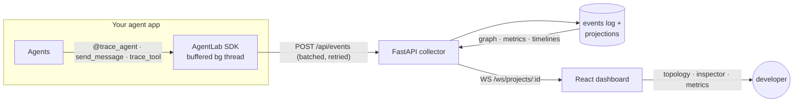

<div align="center">

# AgentLab

**Wireshark + Mininet + Kubernetes for AI agents.**

A production-style observability and control plane for multi-agent AI systems:
SDK-based instrumentation, real-time agent topology, message-level inspection,
run metrics, a replay debugger that steps through any run like a packet
capture, a fault-injection lab, a safe cyber range for simulating malicious
agents, a deterministic trust/risk engine, and a cost/token profiler that
attributes spend per agent and model — with a real model gateway on the roadmap.

`Python 3.12` · `FastAPI` · `PostgreSQL/SQLite` · `React 18 + TypeScript` · `React Flow` · `WebSockets` · `Docker Compose`


</div>

---

## Why

LLM observability tools answer *"what did the model say and what did it cost?"*
Multi-agent systems fail at a different layer:

- **Which agent** caused the bad output?
- **Which message or tool call** triggered the failure?
- **Why** was the task routed to Agent B instead of Agent C?
- Which agent is slow, expensive, unreliable — or behaving maliciously?
- What did the whole system do, **as a network**, from start to finish?

AgentLab treats an agent system the way network engineers treat a network:
agents are nodes, messages are packets, runs are captures you can open,
inspect, and (soon) replay.

## What works today (v0.6)

| Capability | Status |
| --- | --- |
| Python SDK — zero-dependency instrumentation (agents, messages, tools, models, routing, trust) | ✅ |
| Event collector — FastAPI, validated 22-type event schema, idempotent ingest | ✅ |
| Storage — append-only event log + relational projections (PostgreSQL / SQLite) | ✅ |
| Live dashboard — dark-mode infra UI with per-project WebSocket streaming | ✅ |
| Agent topology — React Flow graph: status rings, trust bars, per-node stats, labeled message edges | ✅ |
| Wireshark-style inspector — payload/metadata trees, parent↔child event links, raw JSON | ✅ |
| Run metrics — tokens, cost, avg/p95 latency, error rate, per-agent table, superlatives | ✅ |
| Demo workflow — 5-agent pipeline (success / retry / failure scenarios), no LLM keys needed | ✅ |
| Replay debugger — play/pause/step/scrub any run; jump to next error, tool call, routing decision, or fault; topology and inspector reconstruct at every cursor position | ✅ |
| Fault injection lab — kill / overload / tool failure / model timeout / message delay / message drop, injected from the UI; graph reacts live, every fault is replayable, all simulated | ✅ |
| Security Lab — 8 simulated malicious-agent attacks (prompt injection, mock exfiltration, fake capabilities, spam, trust poisoning, routing manipulation, unsafe tool request, rogue join); suspicious/quarantine markers, flagged edges, attack replay markers — all mock data, nothing real touched | ✅ |
| Trust/risk engine — deterministic, event-derived, explainable scores: per-agent trust + risk, tier badges (trusted → high-risk), "why it changed" factors, score history, run risk summary, and scores that evolve step-by-step in replay | ✅ |
| Cost/token profiler — deterministic local pricing; per-agent + per-model + per-run token and USD attribution; most-expensive / most-token-heavy / slowest / failed-call rankings; model-call inspector; cost that accumulates in replay (mock providers only) | ✅ |
| Model gateway + BYOK (connect real OpenAI / Anthropic / Gemini / Ollama) | 🔜 v0.7 |

## Architecture



Raw events are the source of truth; runs, agents, messages, tool calls, and
routing decisions are **projections** maintained at ingest time. The full
design is in [ARCHITECTURE.md](ARCHITECTURE.md).

## Quickstart

### Option A — Docker, one command (PostgreSQL + API + dashboard)

```bash
make up-demo     # builds + starts the stack, seeds 3 demo runs
open http://localhost:3000
```

(Equivalent to `docker compose up --build -d && docker compose --profile demo run --rm seed`.)

### Option B — bare metal, one command (SQLite, no services)

```bash
make install     # once: venv + editable installs + npm install
make dev         # collector :8000 + demo seed (first boot) + dashboard :5173
open http://localhost:5173
```

Prefer separate terminals? `make api`, `make web`, and `make demo` still exist.

### Option C — just the tests

```bash
make install && make test    # 44 tests: SDK transport/client + API/projections/graph/metrics/WS
```

## Instrument your own agents

```python
from agentlab import AgentLabClient, trace_agent

client = AgentLabClient(
    project_id="my-app",
    api_key="dev-key",
    endpoint="http://localhost:8000",
)

@trace_agent(name="PlannerAgent", role="planner")
def plan(goal: str):
    client.routing_decision(
        task="research",
        candidates=[
            {"agent_id": "researcher", "trust_score": 0.92, "latency_ms": 800},
            {"agent_id": "cache-agent", "trust_score": 0.55, "latency_ms": 90},
        ],
        selected_agent_id="researcher",
        reason="fresh data required; cache confidence below threshold",
        confidence=0.87,
    )
    client.send_message("researcher", {"task": "research", "goal": goal})

@trace_agent(name="ResearchAgent", role="researcher")
def research(query: str):
    with client.trace_tool("web.search", input={"q": query}) as tool:
        tool.output = {"hits": 3}
    client.log_model_call("fable-5", prompt_tokens=900, completion_tokens=260,
                          latency_ms=420, cost_estimate=0.006)

with client.run(name="my-first-traced-run"):
    plan("build the feature")
    research("API best practices")
```

Open the dashboard → your project appears automatically, with the run, the
topology, and every message inspectable. The SDK never raises into your app,
buffers through collector outages, and becomes a no-op with
`AGENTLAB_DISABLED=1`. Full SDK docs: [packages/sdk-python](packages/sdk-python/README.md).

## The demo, in 60 seconds

`make demo` seeds three runs of a simulated software pipeline
(`Planner → Researcher → Coder → Security Reviewer → Reporter`):

1. **success** — clean linear run. Open it → five healthy nodes, labeled message edges.
2. **retry** — a tool times out and is retried; security review bounces a fix
   back to the coder (a back-edge in the topology). Click the
   `coder → security` edge → both messages; click one → full payload + linked
   parent events.
3. **failure** — the security reviewer crashes: run fails, the node turns red,
   its trust score drops to 0.42 — visible in the graph and the agent page.
4. **replay it** — open the failed run → **Replay** tab → press ▶ (or scrub /
   arrow keys). The topology rebuilds event by event; hit **Error** to jump
   straight to the crash with the inspector following the playhead.
5. **break it yourself** — the seeded **Fault Injection Demo — Research Agent
   Timeout** run shows a Lab-injected model timeout killing the researcher
   mid-run (`fault.injected → model.failed → agent.failed → run.failed`).
   Then open **Lab**, pick any run, and inject your own: kill an agent, force
   a tool failure, drop messages on a channel — the status strip and topology
   react live, and the **Fault** marker in Replay takes you straight to the
   moment of injection.
6. **attack it (safely)** — the seeded **Malicious Agent Demo — Prompt
   Injection Attempt** run shows a fake agent joining, lying about its
   capabilities, sending a prompt-injection message, attempting mock secret
   exfiltration, and getting flagged and quarantined. Open its **Replay** tab
   and hit the **Attack** marker to inspect the raw (mock) attack payload. Or
   open **Lab → Security Lab** and launch your own attacks — every payload is a
   `MOCK_*` placeholder; nothing real is read, sent, or executed.
7. **follow the money** — open any run → **Cost & Tokens** tab → see which
   agent burned the most tokens and cost the most (the Coder, on
   `mock:claude-sonnet`) and which was free (the Security reviewer, on
   `mock:local-ollama`). Click a `model.completed` event to inspect exact
   token/cost metadata, or scrub **Replay** to watch the cost build up over time.


The trust/risk engine then explains *why* each agent ended up where it did — a
quarantined malicious agent reads **trust 0.10 / risk 1.00** (never the old
trust 1.00 bug), with a factor breakdown and a full score history:


The Cost & Tokens tab profiles spend per agent and model — in the demo the
**Coder is most expensive** (`mock:claude-sonnet`), the **Researcher is most
token-heavy** (`mock:gpt-4.1`), and the **Security reviewer is free**
(`mock:local-ollama`):


| Fleet dashboard | Message inspector |
| --- | --- |
|  |  |

| Run metrics | |
| --- | --- |
|  | |

Screenshots are generated, not hand-made: `cd apps/web && npm run screenshots`
(Playwright, against the running stack — it also asserts the WebSocket stream
connects).

## Repository layout

```
agentlab/
├── apps/
│   ├── api/                  # FastAPI collector + read API + WS  (22 tests)
│   └── web/                  # React dashboard (Vite, TS, Tailwind, React Flow)
├── packages/
│   └── sdk-python/           # zero-dependency instrumentation SDK (22 tests)
├── examples/
│   └── basic_multi_agent/    # 5-agent simulated pipeline (3 scenarios)
├── docs/plans/               # implementation plans
├── docker-compose.yml        # postgres + api + web + seed profile
├── PRODUCT_SPEC.md · ARCHITECTURE.md · ROADMAP.md
└── Makefile                  # install / test / api / web / demo / up
```

## Security Lab safety

The Security Lab is a **safe cyber range**. Every "attack" is a telemetry
simulation that emits an `attack.injected` event plus mock follow-up events
through the normal pipeline. There is **no real attack behavior anywhere**:

- ✅ Mock secrets only — hardcoded `MOCK_SECRET_TOKEN`, `MOCK_API_KEY_12345`, etc.
- ✅ Every attack payload is tagged `safe_simulation: true`, and event metadata
  asserts `real_secrets_accessed: false` and `real_network_access: false`.
- ❌ No real files or environment variables are read.
- ❌ No network requests are made to external hosts.
- ❌ No shell commands, no file deletion, no real system modification.
- ❌ No malware, exploit, or credential-theft code exists in this repo.

The malicious agent is a *simulated participant* (it shows up as a node); the
`lab-controller` that triggers an attack is excluded from the topology.

### Demo script

```text
make dev
open the dashboard → Malicious Agent Demo — Prompt Injection Attempt
go to the Replay tab → click the Attack marker
inspect the prompt-injection payload (all MOCK_ values)
open Lab → Security Lab
inject a Mock secret exfiltration attempt
watch the graph: malicious-agent turns suspicious → quarantined
```

## How trust & risk scoring works (v0.5)

Every agent carries a **trust score** (0–1) and **risk score** (0–1), derived
deterministically from the run's events — no LLM, no randomness, fully
reproducible and replayable. The same rule table runs in the collector, the
graph, replay, and the dashboard (`apps/api/app/scoring.py` ↔ `apps/web/src/lib/scoring.ts`).

- **Positive events** preserve/raise trust: `agent.completed` (+0.05 trust),
  `tool.completed`, `model.completed`, `message.received`.
- **Failures** degrade reliability: `agent.failed` (−0.15 trust / +0.10 risk),
  `tool.failed` / `model.failed` (−0.10 / +0.08), `message.failed`, `fault.injected`.
- **Adversarial signals** drop trust sharply and raise risk: `message.flagged`
  (−0.20 / +0.25), `attack.injected` (−0.25 / +0.30), `agent.suspicious`
  (forces trust ≤ 0.5, risk ≥ 0.6), `agent.quarantined` (pins trust to
  0.10–0.20, risk ≥ 0.90). All scores clamp to [0, 1].
- Attacks and faults score the **target** agent (not the `lab-controller`
  operator). Every change is **explainable**: the API returns the causing
  event, the previous/new scores, the delta, and a reason.
- Tiers for the UI: `trusted` → `caution` → `suspicious` → `high-risk`.

Endpoints: `GET /api/runs/{id}/scores`, `/runs/{id}/score-history`,
`/runs/{id}/risk-summary`, `/agents/{id}/scores`. A faulted agent shows
degraded reliability (e.g. `caution`) **without** being labelled malicious —
only attack events push an agent into the suspicious/high-risk tiers.

## How cost & token attribution works (v0.6)

Every model call (`model.completed` / `model.failed`) carries `provider`,
`model_name`, `input_tokens`, `output_tokens`, and `latency_ms`. Cost is
**recomputed deterministically** from a static local pricing table
(`apps/api/app/pricing.py`, USD per 1M tokens) — never from an external API —
so it is the single source of truth shared by the cost endpoints, metrics, the
graph, and the dashboard (`apps/web/src/lib/costing.ts` mirrors it for replay).

- Per-agent: input/output/total tokens, estimated cost, avg + p95 latency,
  model-call count, failed calls, retries, most-used model.
- Per-model: tokens, cost, calls, failures, avg latency, provider.
- Per-run: totals plus most-expensive / most-token-heavy / slowest /
  highest-failure agent and a model breakdown.
- Unknown models → `pricing_status: "unknown"`, cost `null` ("Pricing
  unavailable" in the inspector). Missing token fields are treated as zero.
- A failed model call still incurs cost for the input tokens it consumed.

Endpoints: `GET /api/runs/{id}/costs`, `/runs/{id}/token-summary`,
`/agents/{id}/costs`, `/projects/{id}/cost-summary`. Mock providers only:
`mock:gpt-4.1`, `mock:claude-sonnet`, `mock:gemini-pro`, `mock:local-ollama`
(free). Connecting real providers (BYOK / model gateway) is v0.7.

## Known limitations (v0.1–v0.6)

- **Pricing is a static local table and model providers are mock/demo only.**
  v0.6 does not connect to real OpenAI, Anthropic, Gemini, OpenRouter, or
  Ollama providers; token metadata is simulated. BYOK / a real model gateway
  is planned for v0.7.

- **The trust/risk engine is deterministic and event-derived — not a policy or
  access-control system.** It scores and explains; it does not enforce. There's
  no automatic routing impact, no score decay over time, and quarantine remains
  a visualization marker (a later milestone may add enforcement).

Stated plainly so nobody discovers them the hard way:

- **Observability, not orchestration.** AgentLab records and explains agent
  behavior; it does not run, modify, or control your agents.
- **Single-node collector.** WebSocket fan-out is in-process; run one API
  replica. A Redis pub/sub layer is the planned path to horizontal scale.
- **Auth covers the write path only.** `AGENTLAB_API_KEYS` gates `POST
  /api/events`; the read API and dashboard are open, intended for local/
  trusted-network use until team auth lands (v0.9).
- **Trust/risk fallback semantics.** A run's topology shows trust/risk as of
  that run when the run contains `trust.updated`/`risk.updated` events;
  otherwise it falls back to the agent's *current* project-wide score.
- **Timestamps trust the SDK clock.** Events from multiple hosts with skewed
  clocks can interleave imperfectly; per-client `metadata._seq` is a
  tiebreaker, but there is no global logical clock.
- **Schema management is `create_all`.** Fine pre-1.0 with no migrations to
  preserve; Alembic arrives with the first schema change (v0.4). No retention
  policies yet — the event log grows until you prune it.
- **Demo telemetry is simulated.** The example pipeline's model calls, token
  counts, and costs are illustrative metadata, not real LLM usage.
- **Faults and attacks are telemetry simulations.** The Lab emits events *as if*
  the failure or attack happened — it does not intercept or control live agent
  traffic. A "killed" agent's real process keeps running; delay/drop faults and
  attack messages synthesize demonstration events rather than touching in-flight
  traffic. An SDK control-plane hook (real chaos against the demo workflow) is
  future work.
- **Quarantine is a visualization marker, not enforcement.** `agent.quarantined`
  paints the node and is recorded in the timeline/replay; it does not actually
  stop or isolate a running agent (real lifecycle control is out of scope until
  a later milestone).
- **Replay tape is a snapshot.** Opening the Replay tab loads the run's events
  once (up to 5,000); a still-running run keeps streaming, but the tape does
  not grow until the tab is reopened.
- **Replay folds from scratch per cursor move.** Fine into the low thousands
  of events; snapshot memoization is the planned fix for very large runs.
- **Bundle size.** The dashboard ships ~800 KB minified (React Flow +
  Recharts); route-level code-splitting is deferred.

## Roadmap (abridged — see [ROADMAP.md](ROADMAP.md))

- **v0.1 — local observability** ✅ instrument → collect → visualize → inspect
- **v0.2 — replay debugger** ✅ step through any run like a packet capture; jump to error/tool/routing
- **v0.3 — fault injection lab** ✅ six simulated fault types, injectable from the UI, replayable
- **v0.4 — malicious-agent simulation** ✅ eight sandboxed attack scenarios, suspicious/quarantine markers, attack replay
- **v0.5 — trust/risk engine** ✅ deterministic event-derived scoring, explanations, history, tier badges, run risk summary, replay evolution
- **v0.6 — cost/token profiler** ✅ deterministic pricing, per-agent/model/run attribution, rankings, model-call inspector, replay cost evolution
- **v0.7 — model gateway / BYOK**: connect real OpenAI / Anthropic / Gemini / Ollama providers
- **v0.8 — teams**: project auth, retention, multi-user
- **v1.0 — hosted platform**

## License

[MIT](LICENSE)
