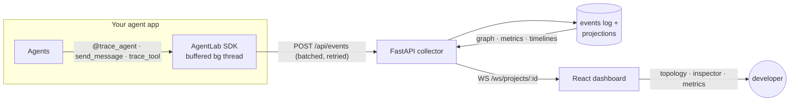

<div align="center">

# AgentLab

**Wireshark + Mininet + Kubernetes for AI agents.**

A production-style observability and control plane for multi-agent AI systems:
SDK-based instrumentation, real-time agent topology, message-level inspection,
run metrics — with replay debugging, fault injection, and trust-aware routing
analysis on the roadmap.

`Python 3.12` · `FastAPI` · `PostgreSQL/SQLite` · `React 18 + TypeScript` · `React Flow` · `WebSockets` · `Docker Compose`

</div>

---

## Why

LLM observability tools answer *"what did the model say and what did it cost?"*
Multi-agent systems fail at a different layer:

- **Which agent** caused the bad output?
- **Which message or tool call** triggered the failure?
- **Why** was the task routed to Agent B instead of Agent C?
- Which agent is slow, expensive, unreliable — or behaving maliciously?
- What did the whole system do, **as a network**, from start to finish?

AgentLab treats an agent system the way network engineers treat a network:
agents are nodes, messages are packets, runs are captures you can open,
inspect, and (soon) replay.

## What works today (v0.1)

| Capability | Status |
| --- | --- |
| Python SDK — zero-dependency instrumentation (agents, messages, tools, models, routing, trust) | ✅ |
| Event collector — FastAPI, validated 22-type event schema, idempotent ingest | ✅ |
| Storage — append-only event log + relational projections (PostgreSQL / SQLite) | ✅ |
| Live dashboard — dark-mode infra UI with per-project WebSocket streaming | ✅ |
| Agent topology — React Flow graph: status rings, trust bars, per-node stats, labeled message edges | ✅ |
| Wireshark-style inspector — payload/metadata trees, parent↔child event links, raw JSON | ✅ |
| Run metrics — tokens, cost, avg/p95 latency, error rate, per-agent table, superlatives | ✅ |
| Demo workflow — 5-agent pipeline (success / retry / failure scenarios), no LLM keys needed | ✅ |
| Replay debugger | 🔜 v0.2 |
| Fault injection lab + malicious-agent simulation | 🔜 v0.3 |
| Trust scoring engine + routing analysis | 🔜 v0.3–0.4 |

## Architecture



Raw events are the source of truth; runs, agents, messages, tool calls, and
routing decisions are **projections** maintained at ingest time. The full
design is in [ARCHITECTURE.md](ARCHITECTURE.md).

## Quickstart

### Option A — Docker Compose (PostgreSQL + API + dashboard)

```bash
git clone <this-repo> && cd agentlab
docker compose up --build -d          # api :8000, dashboard :3000
docker compose --profile demo run --rm seed   # seed 3 demo runs
open http://localhost:3000
```

### Option B — bare metal (SQLite, no services)

```bash
make install     # venv + editable installs + npm install
make api         # terminal 1 — collector on :8000
make web         # terminal 2 — dashboard on :5173
make demo        # terminal 3 — seed the demo pipeline
open http://localhost:5173
```

### Option C — just the tests

```bash
make install && make test    # 44 tests: SDK transport/client + API/projections/graph/metrics/WS
```

## Instrument your own agents

```python
from agentlab import AgentLabClient, trace_agent

client = AgentLabClient(
    project_id="my-app",
    api_key="dev-key",
    endpoint="http://localhost:8000",
)

@trace_agent(name="PlannerAgent", role="planner")
def plan(goal: str):
    client.routing_decision(
        task="research",
        candidates=[
            {"agent_id": "researcher", "trust_score": 0.92, "latency_ms": 800},
            {"agent_id": "cache-agent", "trust_score": 0.55, "latency_ms": 90},
        ],
        selected_agent_id="researcher",
        reason="fresh data required; cache confidence below threshold",
        confidence=0.87,
    )
    client.send_message("researcher", {"task": "research", "goal": goal})

@trace_agent(name="ResearchAgent", role="researcher")
def research(query: str):
    with client.trace_tool("web.search", input={"q": query}) as tool:
        tool.output = {"hits": 3}
    client.log_model_call("fable-5", prompt_tokens=900, completion_tokens=260,
                          latency_ms=420, cost_estimate=0.006)

with client.run(name="my-first-traced-run"):
    plan("build the feature")
    research("API best practices")
```

Open the dashboard → your project appears automatically, with the run, the
topology, and every message inspectable. The SDK never raises into your app,
buffers through collector outages, and becomes a no-op with
`AGENTLAB_DISABLED=1`. Full SDK docs: [packages/sdk-python](packages/sdk-python/README.md).

## The demo, in 60 seconds

`make demo` seeds three runs of a simulated software pipeline
(`Planner → Researcher → Coder → Security Reviewer → Reporter`):

1. **success** — clean linear run. Open it → five healthy nodes, labeled message edges.
2. **retry** — a tool times out and is retried; security review bounces a fix
   back to the coder (a back-edge in the topology). Click the
   `coder → security` edge → both messages; click one → full payload + linked
   parent events.
3. **failure** — the security reviewer crashes: run fails, the node turns red,
   its trust score drops to 0.42 — visible in the graph and the agent page.

Screenshots to add after you run it locally (`docs/screenshots/`):
`dashboard.png` · `topology-retry.png` · `inspector-message.png` · `metrics.png`

## Repository layout

```
agentlab/
├── apps/
│   ├── api/                  # FastAPI collector + read API + WS  (22 tests)
│   └── web/                  # React dashboard (Vite, TS, Tailwind, React Flow)
├── packages/
│   └── sdk-python/           # zero-dependency instrumentation SDK (22 tests)
├── examples/
│   └── basic_multi_agent/    # 5-agent simulated pipeline (3 scenarios)
├── docs/plans/               # implementation plans
├── docker-compose.yml        # postgres + api + web + seed profile
├── PRODUCT_SPEC.md · ARCHITECTURE.md · ROADMAP.md
└── Makefile                  # install / test / api / web / demo / up
```

## Roadmap (abridged — see [ROADMAP.md](ROADMAP.md))

- **v0.1 — local observability** ✅ instrument → collect → visualize → inspect
- **v0.2 — replay debugger**: step through any run like a packet capture; jump to error/tool/routing
- **v0.3 — lab mode**: fault injection (kill/delay/drop/overload) + sandboxed malicious-agent simulations, quarantine flows
- **v0.4 — framework adapters**: LangGraph, CrewAI, OpenAI Agents SDK, MCP
- **v0.5 — teams**: project auth, retention, multi-user
- **v1.0 — hosted platform**

## License

[MIT](LICENSE)
